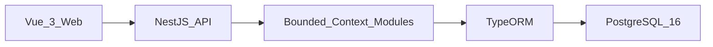

# Timesheet Manager

A small, production-minded timesheet manager built as a modular monolith. Employees submit weekly time against project tasks, approvers approve or reject submitted weeks, approved periods are locked, and every state change is audit logged.

## Architecture



The backend is organized into NestJS modules for `auth`, `users`, `projects`, `tasks`, `timesheets`, `approvals`, `audit`, and `reporting`. Controllers stay thin, services enforce domain rules, and TypeORM repositories handle persistence.

## Local Demo

Requirements: Node.js 22+, pnpm, Docker, and Docker Compose. Only PostgreSQL runs in Docker; the API and web app run as local pnpm processes.

```sh
pnpm install
pnpm demo
```

Open `http://localhost:5173`.

Seeded demo accounts:

- Employee: `employee@example.com` / `password123`
- Approver: `approver@example.com` / `password123`
- Admin: `admin@example.com` / `password123`

## Database

PostgreSQL 16 runs through Docker Compose as service `db`. The container listens on `5432` internally and is published to host port `5433` to avoid collisions with a locally installed PostgreSQL.

```sh
pnpm db:up
pnpm --filter api migration:run
pnpm --filter api seed
```

The local database is `timesheets_dev`; integration tests use `timesheets_test`. Schema changes are committed as TypeORM migrations in `apps/api/src/migrations`. `synchronize: true` is never used.

## Tests

```sh
pnpm lint
pnpm typecheck
pnpm test
pnpm --filter api test:integration
pnpm --filter web test:e2e
```

Integration and E2E tests expect PostgreSQL and the local app stack to be running.

## Data Model

The core model has eight tables: `users`, `roles`, `user_roles`, `projects`, `tasks`, `timesheets`, `timesheet_entries`, and `audit_events`. See [`docs/schema.md`](docs/schema.md) for details.

## Deployment

The v1 deployment target is Fly.io. The app remains a modular monolith with PostgreSQL managed outside the application container. Production migrations run as a discrete deploy step, not on app startup. Backup and restore expectations are documented in [`docs/runbooks/db-backup.md`](docs/runbooks/db-backup.md).

Pull requests create ephemeral Neon database branches through `.github/workflows/neon-workflow.yml` and deploy Fly.io review apps through `.github/workflows/fly-review.yml`. Configure these GitHub Actions settings before relying on previews:

- Secret `FLY_API_TOKEN`: Fly.io organization token allowed to create and deploy review apps.
- Secret `NEON_API_KEY` and variable `NEON_PROJECT_ID`: created by the Neon GitHub integration and used to create/delete per-PR database branches.
- Optional variables `NEON_DATABASE_ROLE` and `NEON_DATABASE_NAME` override the Neon role and database used for review app connections. They default to `neondb_owner` and `neondb`.
- Secrets `REVIEW_JWT_ACCESS_SECRET`, `REVIEW_JWT_REFRESH_SECRET`, and `REVIEW_ADMIN_PASSWORD`: runtime credentials for review apps.
- Optional variables `FLY_ORG`, `FLY_REGION`, and `REVIEW_ADMIN_EMAIL` override the default Fly organization, region, and seeded admin email.

## ADRs

- [`0001-modular-monolith-over-microservices`](docs/adr/0001-modular-monolith-over-microservices.md)
- [`0002-application-level-audit-logging`](docs/adr/0002-application-level-audit-logging.md)
- [`0003-jwt-auth-with-refresh-rotation`](docs/adr/0003-jwt-auth-with-refresh-rotation.md)
- [`0004-typeorm-for-persistence`](docs/adr/0004-typeorm-for-persistence.md)
- [`0005-fly-io-production-target`](docs/adr/0005-fly-io-production-target.md)
- [`0006-layered-testing-strategy`](docs/adr/0006-layered-testing-strategy.md)
- [`0007-period-locking-in-domain-service`](docs/adr/0007-period-locking-in-domain-service.md)
- [`0008-uuid-primary-keys`](docs/adr/0008-uuid-primary-keys.md)
